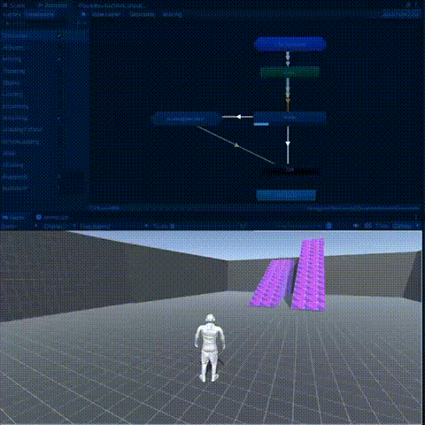
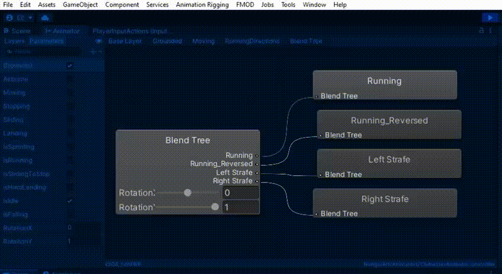

# Unity-Character-Controller
 
Third-person character controller for the movements Run/Jump/Slide using state machine design pattern.

## Showcase
|Style|Image|
|:--:|:--:|
|Animator | |
|Blend Tree  | |
